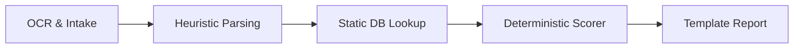
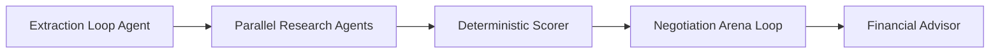
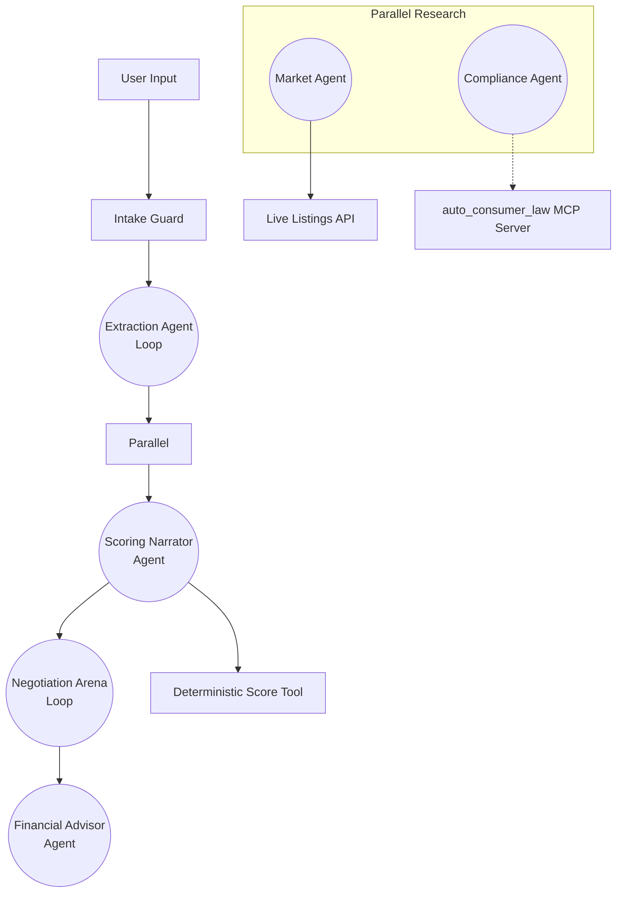

# CatchFees Agents

The car-buying copilot for introverts: a multi-agent system that reads purchase agreements, checks state law, scores the deal deterministically, and negotiates adversarially on the buyer's behalf. 

This repository is an agentic rebuild of [catchfees.com](https://catchfees.com) (a deployed production tool) built for the [Kaggle Vibe Coding Capstone](https://www.kaggle.com/competitions/gemini-vibe-coding-capstone).

**Live demo:** [DEMO_URL] · **Video walkthrough:** [VIDEO_URL]

---

## Quickstart

```bash
uv sync
cp .env.example src/catchfees/.env   # add GOOGLE_API_KEY
uv run adk web src/catchfees          # ADK dev UI at :8000
uv run uvicorn --app-dir src catchfees.server:app --port 8080
                                      # API + built web UI at :8080
uv run pytest                         # full suite (147 tests)
```
*Note: `AUTO_DEV_API_KEY` is optional. Without it, the agent degrades gracefully: it falls back to a bundled MSRP depreciation model instead of live market listings for its price reference.*

---

## The Problem

Dealership finance and insurance (F&I) offices consistently exploit asymmetric information, stacking thousands of dollars in junk fees and mandatory add-ons onto advertised vehicle prices. In 2023, the FTC estimated that junk fees cost American consumers billions annually in the auto sector alone, with predatory loan markups and illegal documentation fees passing entirely unnoticed by exhausted buyers. Traditional calculators require consumers to already understand complex fee caps, taxation rules, and market rates, leaving vulnerable buyers without the real-time, confrontational leverage needed to walk away from a bad deal.

---

## Why Agents?

### Before: The Production Sequential Pipeline


### After: The CatchFees Multi-Agent System


The production pipeline was constrained by static parsing and rigid templates. This agentic rebuild unlocks capabilities that a procedural pipeline could not: a self-verifying extraction loop that actively critiques missing data; parallel market and compliance research; MCP-grounded real-time legal citations rather than static databases; and an adversarial negotiation arena that tests leverage before generating scripts. 

**The Determinism Boundary:** To ensure financial safety, the system explicitly confines LLM judgment to where it adds value (extraction, research, negotiation). The `score_deal` engine is purely deterministic Python code. Its structured result is written to session state by the tool itself and consumed as strict data downstream. LLMs narrate the financial results, but they never compute or reconstruct them.

---

## Architecture



| Stage | Agent Type | Tools | State Keys Written/Read |
| :--- | :--- | :--- | :--- |
| **Extraction** | `LoopAgent` | `extract_deal_terms`, `request_missing_info` | Writes: `deal_input` |
| **Research** | `ParallelAgent` | `check_market_price`, `check_doc_fee_cap` | Reads: `deal_input`<br>Writes: `market_ref`, `doc_fee_cap` |
| **Scoring** | `BaseAgent` | `score_deal` | Reads: `deal_input`, `market_ref`, `doc_fee_cap`<br>Writes: `score_result` |
| **Negotiation** | `LoopAgent` | `run_debate` | Reads: `score_result`<br>Writes: `arena_result` |
| **Advice** | `BaseAgent` | (None) | Reads: `score_result`, `arena_result` |

---

## Serving Layer

The backend uses a FastAPI server wrapping the ADK `InMemoryRunner`. It streams agent execution steps to the frontend via Server-Sent Events (SSE) using custom event types (`agent_step`, `done`, `quarantined`, `stream_error`). The Vite + React web UI consumes these streams in two modes: a calm "Consumer Mode" featuring a 5-stage progress stepper, and a toggleable "Nerd Mode" revealing the live agent feed and arena debate logic. SSE is necessary because the full multi-agent pipeline takes 60–90 seconds to run, and the UI must keep the user engaged by narrating the internal state machine live.

---

## Course Concepts

| Rubric Concept | Implementation File |
| :--- | :--- |
| **Multi-agent ADK** | `src/catchfees/agent.py` (Sequential, Loop, Parallel, custom BaseAgent escalation) |
| **Custom MCP Server** | `mcp_servers/auto_consumer_law/server.py` (consumed via `MCPToolset`) |
| **Security** | `src/catchfees/agents/intake_guard.py`, `SECURITY.md`, `tests/test_security.py` |
| **Agent Evaluation** | `evals/golden_deals.evalset.json` |
| **Deployability** | `Dockerfile`, `DEPLOY.md` |
| **Antigravity CLI** | Built using Google Antigravity + Agents CLI + `ui-ux-pro-max` custom skill (Video: [MM:SS]) |

---

## The Negotiation Arena

Instead of passively listing red flags, the `negotiation_arena` agent runs a strict adversarial debate. It spins up a simulated `dealer`, a `buyer_coach`, and a `referee`. For the top 3 highest-severity negotiable issues (capped for latency), the dealer pushes back with real-world sales tactics, and the coach generates counter-scripts grounded in the MCP server's citations. Finally, the deterministic scoring tool is run on a counterfactual state—calculating exactly how much the deal score would increase and the dollar amount saved ("win these 3 items: score 45 → 88, save $2,400"). 

*Example Transcript:*
> **Dealer:** "That $800 doc fee is pre-printed on all our forms. We literally can't change it, state law requires we charge everyone the same."
> **Coach:** "Actually, under CA Vehicle Code 29841, the maximum allowed documentation fee is $85. I'll need a revised contract with the legal cap applied."

---

## Security Model

The system treats all extracted document text as untrusted input. Before reaching the core orchestration, inputs pass through the `intake_guard`, which screens for prompt injection and quarantines malicious deals. We utilize `before_model` callbacks for strict untrusted-content delimiting and PII redaction before state is committed or logged. Agents are configured with a strict least-privilege tool matrix. Read more in [SECURITY.md](SECURITY.md).

---

## Evaluation

The system is evaluated against a 5-case golden dataset ensuring the deterministic scoring engine accurately discriminates deal quality across edge cases:

| Case | Score Range | Key Flags |
| :--- | :--- | :--- |
| **fair_deal_toyota_camry** | 62 – 88 | *None* (Clean) |
| **predatory_deal_honda_civic** | 0 – 15 | Doc Fee Exceeds Legal Cap, High APR, Long Loan Term, Significantly Above Market |
| **cash_deal_ford_f150** | 75 – 96 | Minimal Add-ons (Green Flag) |
| **good_price_junk_fi_rav4** | 35 – 60 | High APR, Long Loan Term |
| **abnormal_registration_ny_tucson**| 55 – 80 | Registration Fee Seems Too High |

**Test Coverage (147 total passing tests):**
- Tools & MCP: 44 tests
- Arena Handoff & Logic: 3 tests
- Market Analysis: 10 tests (1 skipped)
- Scoring Engine: 67 tests
- Security: 6 tests
- Server: 4 tests
- VIN decoding: 12 tests

---

## Limitations

- The market reference relies on a bundled MSRP depreciation model, relying on live listings only if an optional API key is provided.
- US-state compliance coverage is strictly limited to the data bundled in the `auto_consumer_law` MCP server.
- The `InMemoryRunner` session architecture implies a single-instance demo deployment; horizontal scaling in production would require migrating to a persistent session backend (e.g. Firebase or Redis).

---

## Repo Structure

```text
.
├── AGENTS.md                  # Antigravity rules and context
├── README.md                  # This document
├── SECURITY.md                # Threat model and tool-permission matrix
├── DEPLOY.md                  # Deployment instructions
├── Dockerfile                 # Containerization
├── evals/
│   └── golden_deals.evalset.json
├── mcp_servers/
│   └── auto_consumer_law/     # Custom MCP Server
├── scripts/
│   └── make_poisoned_pdf.py   # Security test fixture generator
├── src/
│   └── catchfees/             # ADK Agent source code
├── tests/                     # Pytest suite
└── web/                       # Vite + React frontend (see web/README.md)
```
